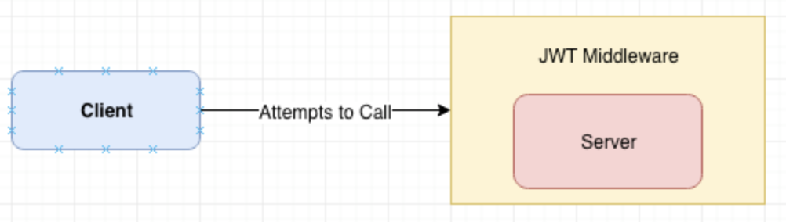

# JWTによるGo REST APIの保護

注意：このチュートリアルの完全なソースコードは以下で見つけられます：[TutorialEdge/go-jwt-tutorial](https://github.com/TutorialEdge/go-jwt-tutorial)  

JWT（JSON Web Token）は、2つの当事者間で転送される主張を表現するためのコンパクトでURLセーフな手段です。  
つまり、JWTを使用すると、クライアントからサーバーに情報をステートレスかつ安全な方法で送信できます。  

# 前提条件
このチュートリアルを進める前に、以下が必要です：

- 開発マシンにGo バージョン1.11以上がインストールされていること

JWTは、ウェブアプリケーションやAPIのセキュリティを向上させるために広く使用されている技術です。  
このチュートリアルでは、GoでJWTを実装し、REST APIを保護する方法を学びます。

# はじめに
JWT標準は、HMACアルゴリズムを使用した秘密鍵、またはRSAやECDSAを使用した公開/秘密鍵ペアを利用します。  

注意：JWTの正式な定義に興味がある場合は、RFC-7519を参照することをお勧めします。  

JWTは、シングルページアプリケーション（SPA）での安全な通信手段として広く使用されており、主に以下の2つの目的で活用されます。  

- 認証
  - 最も一般的な使用法。ユーザーがログインすると、クライアントからの以降のリクエストにJWTが含まれます。
- 情報交換
  - 異なるシステム間で情報を安全に送信するためにも使用されます。
  - 公開/秘密鍵ペアで署名でき、ヘッダーとペイロードに基づいて署名されるため、改ざん防止メカニズムも備えています。

このチュートリアルでは、JWTを使用して通信を行う安全なGo言語ベースのREST APIを構築する方法を詳しく見ていきます。  

# シンプルなREST API
これは非常にシンプルな「Hello World」スタイルのエンドポイントを持ち、ポート8081で実行されます。  

```go
package main

import (
    "fmt"
    "log"
    "net/http"
)

func homePage(w http.ResponseWriter, r *http.Request){
    fmt.Fprintf(w, "Hello World")
    fmt.Println("エンドポイントにアクセスがありました: homePage")
}

func handleRequests() {
    http.HandleFunc("/", homePage)
    log.Fatal(http.ListenAndServe(":8081", nil))
}

func main() {
    handleRequests()
}
```

このコードを実行し、`http://localhost:8081/`にアクセスすると、ブラウザに「Hello World」というメッセージが表示されるはずです。  
このシンプルなAPIを基に、JWTを使用してセキュリティを強化していきます。  

# JWT認証
シンプルなAPIができたので、署名付きJWTトークンを使ってこのAPIを保護しましょう。  
次に、このオリジナルAPIからデータをリクエストするクライアントAPIを構築します。  
これを実現するために、クライアントとサーバーの両方が知っている安全な鍵で署名されたJWTを使用します。  
以下がその動作の流れです：  

- クライアントが共有パスフレーズに基づいて署名付きJWTを生成します。
- クライアントがサーバーAPIにアクセスする際、このJWTをリクエストの一部として含めます。
- サーバーはこのJWTを読み取り、同じパスフレーズを使用してトークンを検証します。
- JWTが有効な場合、機密性の高い「hello world」メッセージをクライアントに返します。無効な場合は「not authorized」を返します。

この構成は、以下のようなアーキテクチャ図になります：  



この方法により、APIへのアクセスを安全に制御することができます。  

# サーバーの実装
実際に動作するシンプルなサーバーを作成してみましょう：

```go
package main

import (
    "fmt"
    "log"
    "net/http"

    jwt "github.com/dgrijalva/jwt-go"
)

var mySigningKey = []byte("captainjacksparrowsayshi")

func homePage(w http.ResponseWriter, r *http.Request) {
    fmt.Fprintf(w, "Hello World")
    fmt.Println("エンドポイントにアクセス: homePage")
}

func isAuthorized(endpoint func(http.ResponseWriter, *http.Request)) http.Handler {
    return http.HandlerFunc(func(w http.ResponseWriter, r *http.Request) {
        if r.Header["Token"] != nil {
            token, err := jwt.Parse(r.Header["Token"][0], func(token *jwt.Token) (interface{}, error) {
                if _, ok := token.Method.(*jwt.SigningMethodHMAC); !ok {
                    return nil, fmt.Errorf("エラーが発生しました")
                }
                return mySigningKey, nil
            })

            if err != nil {
                fmt.Fprintf(w, err.Error())
            }

            if token.Valid {
                endpoint(w, r)
            }
        } else {
            fmt.Fprintf(w, "認証されていません")
        }
    })
}

func handleRequests() {
    http.Handle("/", isAuthorized(homePage))
    log.Fatal(http.ListenAndServe(":9000", nil))
}

func main() {
    handleRequests()
}
```

このコードの概要：

- 単一のエンドポイントを持つシンプルなAPIを作成しています。
- このエンドポイントは`isAuthorized`ミドルウェアデコレータで保護されています。
- `isAuthorized`関数では、リクエストヘッダーにTokenが含まれているか確認し、`mySigningKey`を使用してトークンの有効性を検証します。
- トークンが有効な場合のみ、保護されたエンドポイントにアクセスできます。

# クライアントの実装
JWT保護されたエンドポイントを持つサーバーができたので、それと対話できるものを構築しましょう。  
サーバーの`/`エンドポイントを呼び出すシンプルなクライアントアプリケーションを作成します。  

```go
package main

import (
    "fmt"
    "io/ioutil"
    "log"
    "net/http"
    "time"

    jwt "github.com/dgrijalva/jwt-go"
)

var mySigningKey = []byte("captainjacksparrowsayshi")

func homePage(w http.ResponseWriter, r *http.Request) {
    validToken, err := GenerateJWT()
    if err != nil {
        fmt.Println("トークンの生成に失敗しました")
    }

    client := &http.Client{}
    req, _ := http.NewRequest("GET", "http://localhost:9000/", nil)
    req.Header.Set("Token", validToken)
    res, err := client.Do(req)

    if err != nil {
        fmt.Fprintf(w, "エラー: %s", err.Error())
    }

    body, err := ioutil.ReadAll(res.Body)
    if err != nil {
        fmt.Println(err)
    }
    fmt.Fprintf(w, string(body))
}

func GenerateJWT() (string, error) {
    token := jwt.New(jwt.SigningMethodHS256)

    claims := token.Claims.(jwt.MapClaims)

    claims["authorized"] = true
    claims["client"] = "Elliot Forbes"
    claims["exp"] = time.Now().Add(time.Minute * 30).Unix()

    tokenString, err := token.SignedString(mySigningKey)

    if err != nil {
        fmt.Errorf("エラーが発生しました: %s", err.Error())
        return "", err
    }

    return tokenString, nil
}

func handleRequests() {
    http.HandleFunc("/", homePage)

    log.Fatal(http.ListenAndServe(":9001", nil))
}

func main() {
    handleRequests()
}
```

このコードの概要：

- 単一のエンドポイントを持つシンプルなAPIを定義しています。
- このエンドポイントが呼び出されると、安全な`mySigningKey`を使用して新しいJWTを生成します。
- 新しいHTTPクライアントを作成し、Tokenヘッダーに生成したJWT文字列を設定します。
- この署名付きJWTトークンを使用して、`http://localhost:9000`で実行中のサーバーアプリケーションにアクセスを試みます。
- サーバーはクライアントで生成したトークンを検証し、秘密の「Hello World」メッセージを提供します。

この実装により、クライアントとサーバー間で安全な通信が可能になります。

# 結論
このチュートリアルが、JSON Web Tokensを使用してGoアプリケーションとREST APIを保護する技術の理解に役立ったことを願っています。  
この記事を書くのは非常に楽しかったです。皆さんのGo開発の旅に役立つことを願っています。
