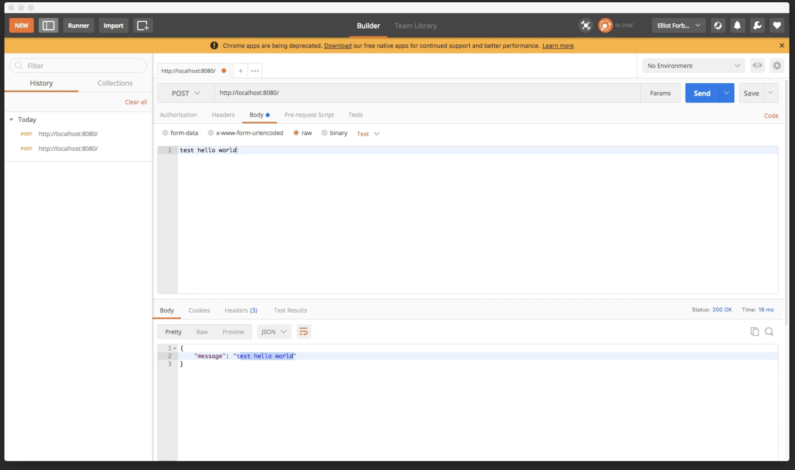

こんにちは、TutorialEdge.netのElliotです。  
今回のチュートリアルでは、GoでHTTPウェブアプリケーションを書くためのGin-Gonicフレームワーク、通称Ginを見ていきます。
Ginは非常に人気があり、GitHubで20,000以上のスターを獲得しています。リンクは説明欄に載せておきます。  
いつも通り、このチュートリアルが役立ったと思ったら、いいねとチャンネル登録をお願いします。現在5,000人の登録者を目指しているので、一人一人の登録が大切です。


では、コードに入りましょう。私の好みのエディタであるVisual Studio Codeを開きました。
まず、単純に「Hello World」を出力する簡単なmain.goファイルを作成しました。
「go run source/main.go」を実行して動作確認ができます。
また、このチュートリアルではGoモジュールも使用します。これは言語のバージョン1.11で新しくリリースされた機能です。プロジェクトを初期化するには「go mod init」を実行します。これで新しいgo.modファイルが作成されます。

main.goファイルを開いて、プログラミングを始めましょう。
まず最初に、Ginフレームワークをインポートします。
トップに括弧を追加し、「github.com/gin-gonic/gin」と入力します。
すぐに動作させるために、ginのデフォルト設定を使用し、ルートエンドポイントに対する簡単なGETリクエストを作成します。
パスを指定し、匿名関数を使ってginコンテキストを受け取り、JSONを返すようにします。
メッセージは「Hello World」とします。
最後に、8080ポートでリッスンして提供するために、r.Runを呼び出します。
コンマを追加して細かな修正をし、「go run source/main.go」で実行します。

これでGin HTTPフレームワークが起動し、8080ポートでリッスンします。
ブラウザでlocalhost:8080にアクセスすると、期待通り「Hello World」というメッセージのJSONが返されます。
ターミナル出力を見ると、リクエストの日時、HTTPステータスコード、リクエスト処理時間、パス、使用されたHTTPメソッドなど、多くの情報が表示されています。
わずか10行ほどのコードで、これだけの情報が得られるのは素晴らしいことです。

```go
package main

import (
    "fmt"

    "github.com/gin-gonic/gin"
)

func main() {
    fmt.Println("Hello World")

    r := gin.Default()
    r.GET("/", func(c *gin.Context) {
        c.JSON(200, gin.H{
            "message": "Hello World",
        })
    })
    r.Run()
}
```

この簡単な例を拡張して、より本番環境に近いアプリケーションを作ってみましょう。
まず、匿名関数を独立した関数に変更し、「homepage」という名前をつけます。
これにより、main関数内のコードが整理され、他のパッケージからの機能も追加しやすくなります。

```go
package main

import (
    "fmt"

    "github.com/gin-gonic/gin"
)

func HomePage(c *gin.Context) {
    c.JSON(200, gin.H{
        "message": "Hello World",
    })
}

func main() {
    fmt.Println("Hello World")

    r := gin.Default()
    r.GET("/", HomePage)
    r.Run()
}
```

いつも通り、変更するたびにテストして、期待通りの動作をしているか確認します。
これで、アプリケーション内に単純なGETエンドポイントが公開されました。
しかし、本番レベルのAPIでは通常、POST、PUT、DELETE、PATCHなど、他のHTTPメソッドも使用します。
では、例を拡張して、これらの異なるエンドポイントをアプリケーションに追加してみましょう。

まず、POSTエンドポイントを作ります。
同じパスを使用し、r.POSTで新しい関数「postHomepage」を作成します。
main関数の上に、この関数を定義します。
GETエンドポイントと同様に、ginコンテキストを受け取り、JSONを返します。
メッセージを少し変更して「post homepage」とします。

```go
package main

import (
    "fmt"

    "github.com/gin-gonic/gin"
)

func HomePage(c *gin.Context) {
    c.JSON(200, gin.H{
        "message": "Home Page",
    })
}

func PostHomePage(c *gin.Context) {
    c.JSON(200, gin.H{
        "message": "Post Home Page",
    })
}

func main() {
    fmt.Println("Hello World")

    r := gin.Default()
    r.GET("/", HomePage)
    r.POST("/", PostHomePage)
    r.Run()
}
```

アプリケーションを再起動し、新しいPOSTエンドポイントをテストするために、Postmanというプログラムを使用します。Postmanは、世界中のウェブ開発者やプログラマーに非常に人気のあるRESTクライアントです。
Postmanで、localhost:8080のURLを入力し、GETリクエストを送信すると、ブラウザで見たのと同じ「Hello World」メッセージが返されます。


メソッドをPOSTに変更して同じリクエストを送信すると、新しく追加した「post homepage」レスポンスが返されます。  

これで、シンプルなAPIが作成でき、GETとPOSTの両方のエンドポイントが公開されました。同様に、PUT、DELETE、PATCH、HEAD、OPTIONSなど、他のHTTPメソッドにも対応できます。

次に、より複雑な機能を追加してみましょう。
クエリ文字列、パスパラメータ、POSTリクエストのボディの取得などです。
これらは多くのAPIで一般的に必要となるタスクです。

まず、REST APIでクエリ文字列を扱う方法を見てみましょう。
新しいエンドポイントを作成し、GETメソッドで「/query」にアクセスできるようにします。
「queryStrings」という新しい関数を作成し、「/query」リクエストを受け取ってクエリ文字列をパースします。
例えば、「name=Elliott&age=24」のようなクエリ文字列を処理します。
main関数の上に「queryStrings」関数を定義します。
ginコンテキストへのポインタを受け取り、c.Query("name")とc.Query("age")を使用してクエリパラメータを取得します。
そして、取得した名前と年齢をJSONレスポンスとして返します。

```go
package main

import (
    "fmt"

    "github.com/gin-gonic/gin"
)

func HomePage(c *gin.Context) {
    c.JSON(200, gin.H{
        "message": "Home Page",
    })
}

func PostHomePage(c *gin.Context) {
    c.JSON(200, gin.H{
        "message": "Post Home Page",
    })
}

func QueryStrings(c *gin.Context) {
    name := c.Query("name")
    age := c.Query("age")

    c.JSON(200, gin.H{
        "name": name,
        "age": age,
    })
}

func main() {
    fmt.Println("Hello World")

    r := gin.Default()
    r.GET("/", HomePage)
    r.POST("/", PostHomePage)
    r.GET("/query", QueryStrings)
    r.Run()
}
```

実行して、Postmanで新しいエンドポイントをテストします。
「/query?name=Elliott&age=24」のようなURLを送信すると、期待通りにJSONが返されます。
クエリ文字列から名前と年齢を正しくパースできていることがわかります。


次に、クエリ文字列パラメータとは異なるパスパラメータの扱い方を見てみましょう。
新しいエンドポイントを定義し、「/path/:name/:age」のような形式でパラメータを受け取ります。
「pathParameters」という新しい関数を作成し、c.Param("name")とc.Param("age")を使用してパスパラメータを取得します。
これはクエリ文字列の処理と非常に似ていますが、c.Queryの代わりにc.Paramを使用します。

```go
package main

import (
    "fmt"

    "github.com/gin-gonic/gin"
)

func HomePage(c *gin.Context) {
    c.JSON(200, gin.H{
        "message": "Home Page",
    })
}

func PostHomePage(c *gin.Context) {
    c.JSON(200, gin.H{
        "message": "Post Home Page",
    })
}

func QueryStrings(c *gin.Context) {
    name := c.Query("name")
    age := c.Query("age")

    c.JSON(200, gin.H{
        "name": name,
        "age": age,
    })
}

func PathParameters(c *gin.Context) {
    name := c.Param("name")
    age := c.Param("age")

    c.JSON(200, gin.H{
        "name": name,
        "age": age,
    })
}

func main() {
    fmt.Println("Hello World")

    r := gin.Default()
    r.GET("/", HomePage)
    r.POST("/", PostHomePage)
    r.GET("/query", QueryStrings)
    r.GET("/path/:name/:age", PathParameters)
    r.Run()
}
```

このエンドポイントもテストしてみましょう。
Postmanで「/path/testname/100」のようなURLを送信すると、パスパラメータが正しくパースされ、JSONフォーマットで返されることが確認できます。


最後に、POSTリクエストのボディを関数内で読み取る方法を見てみましょう。
既存のPOSTエンドポイントを修正して、リクエストのボディから値を読み取れるようにします。

`postHomepage`関数を更新し、c.Request.Bodyを使ってリクエストボディを読み取ります。
`ioutil.ReadAll`を使用してボディを文字列に変換し、エラーチェックを行います。
そして、読み取った値をメッセージとしてJSONレスポンスに含めます。


```go
package main

import (
    "fmt"

    "github.com/gin-gonic/gin"
)

func HomePage(c *gin.Context) {
    c.JSON(200, gin.H{
        "message": "Home Page",
    })
}

func PostHomePage(c *gin.Context) {
    body := c.Request.Body
    value, err := ioutil.ReadAll(body)
    if err != nil {
        fmt.Println(err,Error())
    }
    c.JSON(200, gin.H{
        "message": string(value),
    })
}

func QueryStrings(c *gin.Context) {
    name := c.Query("name")
    age := c.Query("age")

    c.JSON(200, gin.H{
        "name": name,
        "age": age,
    })
}

func PathParameters(c *gin.Context) {
    name := c.Param("name")
    age := c.Param("age")

    c.JSON(200, gin.H{
        "name": name,
        "age": age,
    })
}

func main() {
    fmt.Println("Hello World")

    r := gin.Default()
    r.GET("/", HomePage)
    r.POST("/", PostHomePage)
    r.GET("/query", QueryStrings)
    r.GET("/path/:name/:age", PathParameters)
    r.Run()
}
```

これを実行し、テストデータでPOSTリクエストを送信すると、期待通りのJSONレスポンスが返されます。
メッセージにはPOSTボディの値が含まれています。



以上が今回のチュートリアルの内容です。将来のチュートリアルでは、このAPIのテストや本番環境での使用方法について見ていく予定です。
このチュートリアルが役立ったと思ったら、いいねをつけてコメント欄で教えてください。質問があればコメント欄でお聞きします。いつも通り、プログラミングコンテンツの続きを見たい方はチャンネル登録をお願いします。ありがとうございました。
