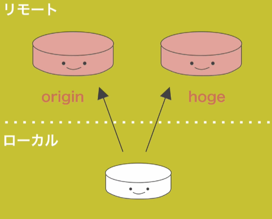
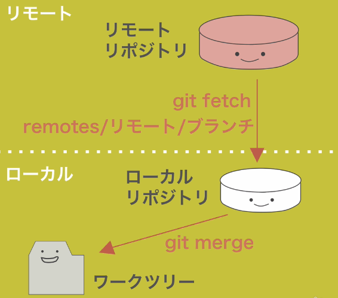

# Git tutorial
## 変更をステージに追加する
```
git add <ファイル名>
git add <ディレクトリ名>
git add .
```
## 変更を記録する（コミット）
```
git commit
git commit -m "<メッセージ>"
git commit -v
```
`git commit -m "<メッセージ>"`：メッセージ付きで記録する  
`git commit -v`：変更内容を確認できる

## 現在の変更状況を確認する
```
git status
```
## 変更差分を確認する
```
# "git add" する前の変更分
git diff
git diff <ファイル名>

# "git add" した後の変更分
git diff --staged
```


## 変更履歴を確認する
```
git log

# 一行で表示
git log --online

# ファイルの変更差分を表示
git log -p index.html

# 表示するコミット数を制限する
git log -n <コミット数>
```
## ファイルの削除を記録する
```
# ファイルごと削除
git rm <ファイル名>
git rm <ディレクトリ名>

# ファイルを残したいとき
git rm --cached <ファイル名>
```


## ファイルの移動を記録する
```
git mv <旧ファイル> <新ファイル>

# 以下のコマンドと同じ
mv <旧ファイル> <新ファイル>
git mv <旧ファイル>
git add <新ファイル>
```
## コマンドにエイリアスをつける
```
git config --global alias.ci commit
```
## 管理しないファイルをGitの管理から外す
.gitignoreファイルに指定する  
### .gitignoreファイルの書き方
```
# #から始まる行はコメント
# 指定したファイルを除外
.node-version
# ルートディレクトリを指定
/root.md
# ディレクトリ以下を除外
dir/
# /以外の文字列にマッチ「*」
/*/*.css
```
## ファイルへの変更を取り消す
```
git checkout -- <ファイル名>
git checkout -- <ディレクトリ名>

# 全変更を取り消す
git checkout -- .
```
`--`をつけているのはブランチ名とファイル名がかぶったときにGitがわからなくならないため


## ステージした変更を取り消す
```
git reset HEAD <ファイル名>
git reset HEAD <ディレクトリ名>

# 全変更を取り消す
git reset HEAD .
```
指定した変更をステージから取り消すだけなので、ワークツリーのファイルには影響を与えない


## 直前のコミットをやり直す
```
git commit --amend
```
リモートリポジトリにPushしたコミットはやり直してはいけない。


## リモートを表示する
```
git remote

# 対応するURLを表示
git remote -v
```
設定しているリモートリポジトリの情報を表示する



# リモートリポジトリを新規追加する
```
git remote add <リモート名> <リモートURL>
```
# リモートから情報を取得する（フェッチ）
```
git fetch <リモート名>
git fetch origin
```


# リモートから情報を取得してマージする（プル）
```
git pull <リモート名> <ブランチ名>
git pull origin master

# 上記コマンドは省略可能
git pull

# これは下記コマンドと同じ
git fetch origin master
git merge origin/master
```

<!-- ここから -->


# ブランチを新規追加する
```
git branch <ブランチ名>

# 例
git branch feature
```
ブランチを作成するだけでブランチの切り替えは行わない。  

# ブランチの一覧を表示する
```
git branch

# すべてのブランチを表示する
git branch -a
```

## 実習
```
git branch
git branch feature
git branch
git log --oneline --decorate
```
# ブランチを切り替える
```
git checkout <既存ブランチ名>

# ブランチを新規作成して切り替える
git checkout -b <新ブランチ名>

# 例
git checkout feature
git checkout -b feature
```
`-b`オプションをつけるとブランチの作成と切り替えを一度にできる。

## 実習
```
git branch
git checkout feature
git branch

featureブランチにfeature.htmlをプッシュ
masterブランチにmaster.htmlをプッシュ
```

# 変更履歴をマージする
```
git merge <ブランチ名>
git merge <リモートブランチ名/ブランチ名>

# 例
git merge origin/master
```
作業中のブランチにマージする

## マージには3種類ある
### Fast Foward：早送りになるマージ
hotfixが指すブランチをmasterが指す。ブランチが枝分かれしていないときはブランチのポインタを前に進めるだけ。
### Auto Merge：基本的なマージ
枝分かれして開発していた場合、マージコミットという新しいコミットを作る。
### conflict
同じファイルの同じ行に対して異なる編集を行ったとき


## 実習
```
git pull origin master
cat index.html
git log --oneline

# auto merge
git branch
git checkout feature

featureブランチを修正

git add index.html
git commit
git push

master
git merge feature
ls
cat feature.html
git log --oneline
```

# コンフリクト
## コンフリクトの解決方法
1. ファイルの内容を書き換える
2. 「>>>」「<<<」「===」の記述を削除

## コンフリクトを起こさないために
- 複数人で同じファイルを変更しない
- pullやmergeする前に変更中の状態をなくしておく（commitやstashをしておく）
- pullするときはpullするブランチに移動してからpullする
- コンフリクトしても慌てない

# ブランチ名を変更・削除する
## 変更する
```
git branch -m <ブランチ名>

# 例
git branch -m new_branch
```
自分が作業しているブランチの名前を変更する。
`-m`：move

## 削除する
```
git branch -d <ブランチ名>

# 例
git branch -d feature

# 強制削除する
git branch -D <ブランチ名>
```
`-d`：delete
masterにマージされていない変更が残っている場合は削除しない。

## 実習
```
git branch
git checkout feature
git branch -m new_feature
git branch
git checkout master
git branch -d new_feature
git branch
```
# ブランチ運用の基本ルール
masterブランチをリリース用ブランチに、開発はトピックブランチを作成して進めるのが基本

# リモートブランチ
リモートブランチは<リモート>/<ブランチ>で参照できる。

# 実習
```
git fetch
git branch -a
```

# GitHubを利用した開発手順
## プルリクエスト
プルリクエストは、自分の変更したコードをリポジトリに取り込んでもらえるように依頼する機能。

### プルリクエストの手順
1. masterブランチを最新に更新
2. ブランチを作成
3. ファイルを変更
4. 変更をコミット
5. GitHubへプッシュ
6. プルリクエストを送る
7. コードレビュー
8. プルリクエストをマージ
9. ブランチを削除

### 実習
```
git branch
git pull origin/master
git status
git checkout -b pull_request

ファイルを変更

git add inde.html
git commit
git push origin pull_request
```
# GitHub Flow
## GitHub Flowを実践する上でのポイント
- masterブランチは常にデプロイできる状態に保つ
- 新開発はmasterブランチから新しいブランチを作成してスタート
- 作成した新しいブランチ上で作業しコミットする
- 定期的にPushする
- masterにマージするためにプルリクエストを使う
- 必ずレビューを受ける
- masterブランチにマージしたらすぐにデプロイする
  - テストとデプロイ作業は自動化

# リベースする
変更統合の際に履歴を綺麗に整えるために使う

## リベースで履歴を整えた形で変更を統合する
```
git rebase <ブランチ名>

# 例
git rebase master
```
ブランチの起点となるコミットを別のコミットに移動する。

### 例
```
# featureブランチ
git checkout feature
git rebase master

# masterブランチ
git checkout master
git merge feature
```
featureブランチでファストフォワードが起こっている。

## 実習
```
git branch
git branch feature
git rebase master
git log
git checkout master
git marge feature

git branch -d feature
```

fast Fowordしないようにする
```
git config --global merge.ff false
```

### rebaseの注意点
GitHubにプッシュしたコミットをリベースするのはNG  
`git push -f`は使わない。

# マージかリベースか
## マージ
- コンフリクトの解決が比較的簡単
- マージコミットがたくさんあると履歴が複雑化する

## リベース
- 履歴をきれいに保つことができる
- コンフリクトの解決が若干面倒（コミットそれぞれに解消が必要）

プッシュしていないローカルの変更にはリベースを使い、プッシュした後はマージを使う。  
コンフリクトしそうならマージを使う。  

# プルの設定をリベースに変更する
プルにはマージ型とリベース型がある。
おすすめはリベース型。

## pullのマージ型
```
git pull <リモート名> <ブランチ名>

# 例
git pull origin master
```
マージコミットが残るから、マージしたという記憶を残したい時に使う。

## pullのリベース型
```
git pull --rebase <リモート名> <ブランチ名>

# 例
git pull --rebase origin master
```
マージコミットが残らないので、GitHubの内容を取得したいだけのときは--rebaseを使う。

## プルをリベース型に設定する
```
git config --global pull.rebase true

# masterブランチでgit pullするときだけ
git config branch.master.rebase true
```
--rebaseオプションをつけなくてもgit pullの挙動がリベース型なる。

# コミットをきれいに整えてからPushしたいときは履歴を書き換えよう。
※GitHubにPushしていないコミット

# 直前のコミットをやり直す
```
git commit --amend
```
# 複数のコミットをやり直す
```
git rebase -i <コミットID>

# 例
git rebase -i HEAD~3

pick gh21f6d ヘッダー修正
pick 193054e ファイル追加
pick 84gha0d README修正
```
`-i`は-interactiveの略。
対話的リベースといい、やり取りしながら履歴変更を行う。
```
# やり直したいcommitをexitにする
edit gh21f6d ヘッダー修正
pick 193054e ファイル追加
pick 84gha0d README修正

# やり直したら実行する
git commit --amend

# 次のコミットへ進む（リベース完了）
git rebase --continue
```
## コミットの指定方法
### HEAD~1
1番目の親を指定する。
HEADを基点にして数値分の親コミットまで指定する。

### HEAD^2
マージした場合の2番目の親を指定する。

## rebase -iコマンドの一連の流れ
1. `git rebase -i`コマンドで対話的リベースモードに入る
2. 修正したいコミットをeditにしてコミットエディタを終了する
3. editのコミットのところでコミットの適用が止まる。
4. `git commit --amend`で修正。
5. `git rebase --continue`で次コミットへ行く
6. pickだとそのままのコミット内容を適用して次へいく。

## 実習
```
touch first.html
git add first.html
git commit -m "first.htmlを追加"

touch second.html
git add second.html
git commit -m "second.htmlを追加"

touch third.html
git add third.html
git commit -m "third.htmlを追加"

git rebase -i HEAD~3

# コミットメッセージの修正
git commit --amend

git rebase --continue
```

## コミットを並び変える、削除する
```
git rebase -i HEAD~3

```
履歴は古い順に表示されるので注意。  

# コミットをまとめる
```
git rebase -i HEAD~3

pick
squash
squash
```
squashを指定するとそのコミットを直前のコミットとひとつにする

# コミットを分割する
```
git rebase -i HEAD~3

pick
pick
edit

git reset HEAD^
git add README
git commit -m 'README修正'
git add index.html
git commit -m 'index.html修正'
git rebase --continue
```
# タグ付けする
## タグを一覧表示する
```
git tag

# パターンを想定してタグを表示
gi tag -l "201705"
```
`git tag`コマンドはアルファベット順にタグを表示する

## タグを作成する
タグには、注釈つき（annotated）版と軽量（lightweight）版の2種類がある。

### タグを作成する（注釈付きタグ）
```
git tag -a [タグ名] -m "メッセージ"

# 例
git tag -a 20170520_01 -m "version 20170520_01"
```
`-a`オプションをつけると注釈つきタグを生成する。
`-m`オプションをつけるとエディタを立ち上げずにメッセージを入力できる。

### タグを作成する（軽量版タグ）
```
git tag [タグ名]
git tag 20170520_01

# 後からタグ付けする
git tag [タグ名][コミット名]
git tag 20170520_01 8a6cbc4
```
オプションをつけないと軽量版タグを作成する。

### タグのデータを表示する
```
git show [タグ名]
git show 20170520_01
```
タグのデータと関連付けられたコミットを表示する。

# タグをリモートリポジトリに送信する
タグをリモートに送信するには`git push`コマンドで指定する必要がある。
```
git push <リモート名> <タグ名>
git push origin 20230707

# タグを一斉に送信する
git push origin --tags
```
`--tags`をつけるとローカルにあってリモートリポジトリに存在しないタグを一斉に送信する。

# 作業を一時避難する
作業が途中でコミットしたくないが、別ブランチで作業する必要がある。
そういう時に作業を一時避難する。

## 作業を一時避難する
```
git stash
git stash save
```
`save`は省略可能。

## 非難した作業を確認する
```
git stash list
```
避難した作業の一覧を表示する。

## 避難した作業を復元する
```
# 最新の作業を復元する
git stash apply

# ステージの状況もあわせて復元する
git stash apply --index

# 特定の作業を復元する
git stash apply [スタッシュ名]
git stash apply stash@{1}
```
applyは適用するという意味。

## 避難した作業を削除する
```
# 最新の作業を削除する
git stash drop

# 特定の作業を削除する
git stash drop <スタッシュ名>
git stash drop stash@{1}

# 全作業を削除する
git stash clear
```

